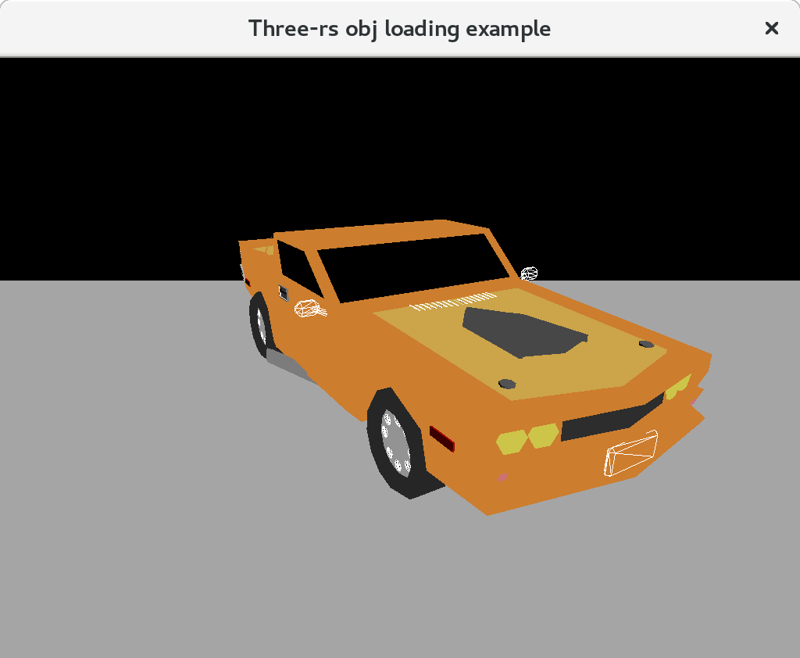

# three-rs

Totally not inspired Rust 3D library! Ok, maybe, just a tiny bit... by [Three.JS](http://threejs.org).

If you a looking for something simple to prototype 3D graphics with, you found it.

## Screenshots

## Motivation and Goals

  1. Ergonomics is first priority. Being able to prototype quickly and code intuitively is more important than capturing all the 3D features. We already have a solid foundation with [gfx-rs](https://github.com/gfx-rs/gfx), so let's make some use of it by providing a nice higher-level abstraction.
  2. Follow "Three.JS" - this is simpler than coming up with a brand new API (like [kiss3d](https://github.com/sebcrozet/kiss3d)), yet instantly familiar to a large portion of Web develper. Some deviations from the original API are imminent.
  3. Explore the capabilities of Rust to mimic deep object-oriented nature of JavaScript. This is a tough challenge, involving channels, defer implementations, blood, and sweat.
  4. Battle-test the [genmesh](https://github.com/gfx-rs/genmesh) library. Being able to create cubes, spheres, cylinders (and more) with one-liners allows for nice proceduraly generated demos.
  5. Play with Component-Graph System concept, provided by [froggy](https://github.com/kvark/froggy). It's a good fit for the scene graph implementation that is fast and usable.

Interestingly, you can observe an new trend in rust-gamedev community to mimic existing libraries: [Amethyst](https://github.com/amethyst/amethyst) was created to be Rust version of Autodesk [Stingray](https://www.autodesk.com/products/stingray/overview) engine (formely Bitsquid), [ggez](https://github.com/ggez/ggez) is a re-interpretation of Love2D engine, and now `three-rs` attempting to capture _Three.JS_ usability. This is not to say that we failed for find [our own path](https://users.rust-lang.org/t/game-engine-design-lego-bricks/9151), I just see the current step inevitable.

## License

Licensed under either of

 * Apache License, Version 2.0, ([LICENSE-APACHE](LICENSE-APACHE) or http://www.apache.org/licenses/LICENSE-2.0)
 * MIT license ([LICENSE-MIT](LICENSE-MIT) or http://opensource.org/licenses/MIT)

at your option.

### Contribution

Unless you explicitly state otherwise, any contribution intentionally submitted
for inclusion in the work by you, as defined in the Apache-2.0 license, shall be
dual licensed as above, without any additional terms or conditions.