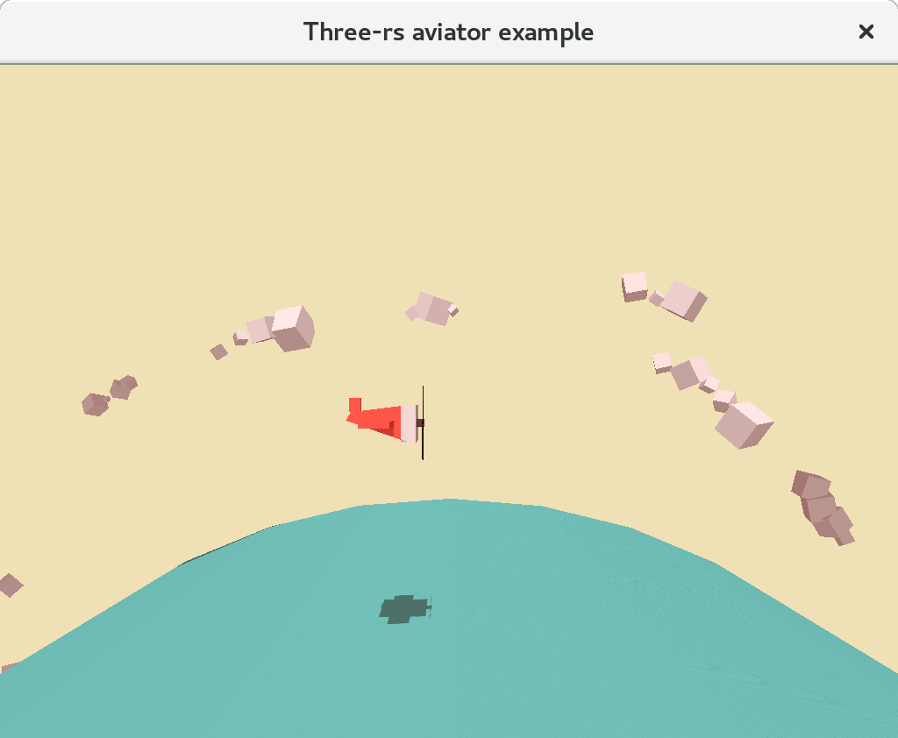

# three-rs

Totally not inspired Rust 3D library! Ok, maybe, just a tiny bit... by [Three.JS](http://threejs.org).

If you a looking for something simple to prototype 3D graphics with, you found it.

## Screenshots

## Motivation and Goals

Three-rs is focused at the ergonomics first and foremost. Being able to prototype quickly and code intuitively is more important than capturing all the 3D features. We already have a solid foundation with [gfx-rs](https://github.com/gfx-rs/gfx/tree/pre-ll), so let's make some use of it by providing a nice higher-level abstraction.

We do leave the room for optimization opportunity here. Given the low-level declarative style of the API, the implementation can do a lot of tricks to ensure decent performance by default:
  - use of efficient low-level native graphics APIs
  - reordering the calls into passes, minimizing state changes
  - automatic instancing

Interestingly, you can observe an new trend in rust-gamedev community to mimic existing libraries: [Amethyst](https://github.com/amethyst/amethyst) was created to be Rust version of Autodesk [Stingray](https://www.autodesk.com/products/stingray/overview) engine (formely Bitsquid), [ggez](https://github.com/ggez/ggez) is a re-interpretation of Love2D engine, and now `three-rs` attempting to capture _Three.JS_ usability. This is not to say that we failed to find [our own path](https://users.rust-lang.org/t/game-engine-design-lego-bricks/9151), I just see the current step inevitable.

## License

Licensed under either of the following terms at your choice:
 * Apache License, Version 2.0, ([LICENSE-APACHE](LICENSE-APACHE) or http://www.apache.org/licenses/LICENSE-2.0)
 * MIT license ([LICENSE-MIT](LICENSE-MIT) or http://opensource.org/licenses/MIT)

### Contribution

Unless you explicitly state otherwise, any contribution intentionally submitted
for inclusion in the work by you, as defined in the Apache-2.0 license, shall be
dual licensed as above, without any additional terms or conditions.
